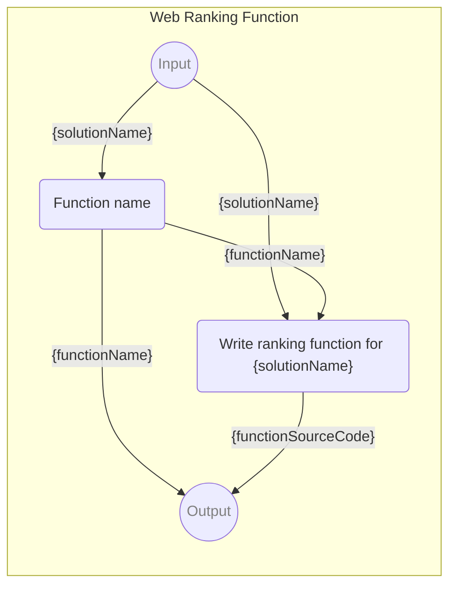

# Web Ranking Function

-   INPUT PARAM {solutionName} Name for the system which we can build the web in
-   OUTPUT PARAM {functionName} Name of the ranking function for the system
-   OUTPUT PARAM {functionSourceCode} Source code of the ranking function for the system

<!--Graph-->
<!-- ⚠️ WARNING: This section was auto-generated -->



<!--/Graph-->

## Function name

-   EXECUTE SCRIPT

```javascript
`rank${capitalize(solutionName.split(/\W/g).join('').toLowerCase())}Solution`;
```

`-> {functionName}`

## Write ranking function for {solutionName}

-   MODEL VARIANT Chat
-   MODEL NAME `gpt-4-0125-preview`
-   POSTPROCESSING `extractBlock`
<!-- TODO:> EXPECT "export function {functionName}(prefecences) {"-->

```

You are an expert in web design and systems and solutions to build the client's web, write new ranking function, for **{solutionName}**.

## Rules

- Write only the ranking function, not the explanation
- The function should be called `{functionName}`.
- Include all advantages and disadvantages of the solution
- Preferences are fixed and you should not create new ones.
- Solution rank are fixed and you should not use not listed below.
- The ranking function works for Czech clients, so the texts are in Czech and the prices are in CZK (Czech crowns).

## Prefecences

You are given the following preferences which you are using to rank the solution:

- `webType` - Type of the web you are building. Possible values are: 'presentation', 'eshop', 'blog', 'application'
- `pagesCount` - Number of static pages on the web
- `productsCount` - Number of products that are going to be sold on the web
- `customFunctionsCount` - Number of custom functions that are needed on the web, like a custom form, custom search, etc.
- `budgetUpfront` - Budget for the web upfront in CZK
- `budgetPerMonth` - Budget for the web per month in CZK
- `daysToDeadline` - Number of days to the deadline
- `levelOfControl` - Level of control that the client wants to have over the web. Possible values are from 0 to 1 (1 = 100% = pixel-perfect)


## Solution rank

You can use only following methods of `solutionRank` to rank the solution:

- `note("Some note about the solution")`
- `pro("Benefit of the solution")`
- `con("Disadvantage of the solution")`
- `bigPro("Benefit of the solution")`
- `bigCon("Disadvantage of the solution")`
- `smallPro("Benefit of the solution")`
- `smallCon("Disadvantage of the solution")`
- `rankPrefecence` (see usage below)


## Sample

Here is an example of the ranking function for **Wordpress**:

\`\`\`\javascript
/**
 * Rank the suitability of the WordPress solution based on user preferences.
 */
export function rankWordpressSolution(prefecences) {
    const {
        webType, // <- 'presentation', 'eshop', 'blog', 'application'
        pagesCount,
        productsCount,
        customFunctionsCount,
        budgetUpfront, // <- In CZK
        budgetPerMonth, // <- In CZK
        daysToDeadline,
        levelOfControl,
    } = prefecences;

    const solutionRank = new SolutionRank(
        'Self-hosted WordPress',
        'Využijte nejrozšířenější open-source CMS na světě pro vytvoření svých webových stránek.',
    );

    solutionRank.pro('Nejrozšířenější open-source CMS na světě.');

    solutionRank.goodFor({ webType }, ['presentation', 'blog']);
    solutionRank.badFor({ webType }, ['application', 'eshop']);

    solutionRank.rankPrefecence(
        { pagesCount },
        {
            ideal: 1000,
            possible: 10000,
        },
    );

    solutionRank.rankPrefecence(
        { productsCount },
        {
            ideal: 0,
            possible: 1000, // <- With some plugins like WooCommerce
        },
    );

    if (productsCount > 0) {
        solutionRank.note(
            'Existují pluginy jako [WooCommerce](https://wordpress.org/plugins/woocommerce/), které umožňují vytvořit eshop na WordPressu.',
        );
    }

    solutionRank.rankPrefecence(
        { customFunctionsCount },
        {
            ideal: 0,
            possible: 30,
        },
    );

    solutionRank.rankPrefecence(
        { budgetUpfront },
        {
            ideal: 30000 /* CZK */,
            possible: 7000 /* CZK */,
        },
    );

    solutionRank.rankPrefecence(
        { budgetPerMonth },
        {
            ideal: 1000 /* CZK */,
            possible: 100 /* CZK */,
        },
    );

    solutionRank.rankPrefecence(
        { daysToDeadline },
        {
            ideal: 90 /* days */,
            possible: 7 /* days */,
        },
    );

    solutionRank.rankPrefecence(
        { levelOfControl },
        {
            ideal: 40 /* % */ / 100,
            possible: 60 /* % */ / 100,
        },
    );

    return solutionRank.calculate();
}
\`\`\`


```

`-> {functionSourceCode}`
